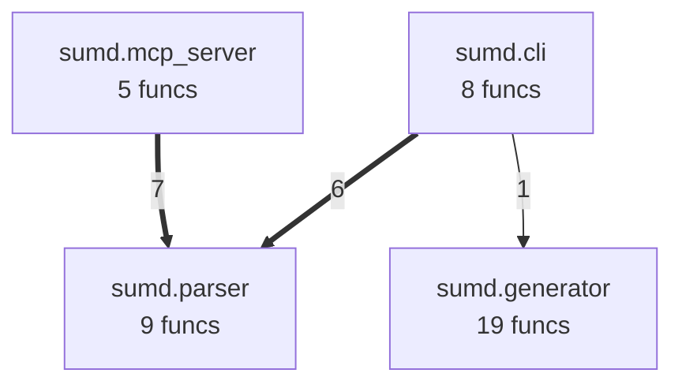
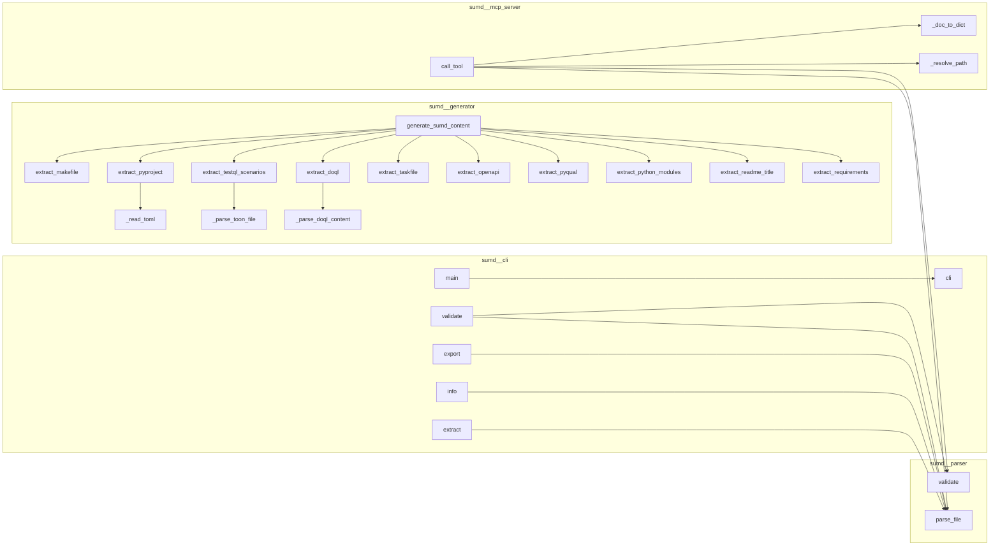
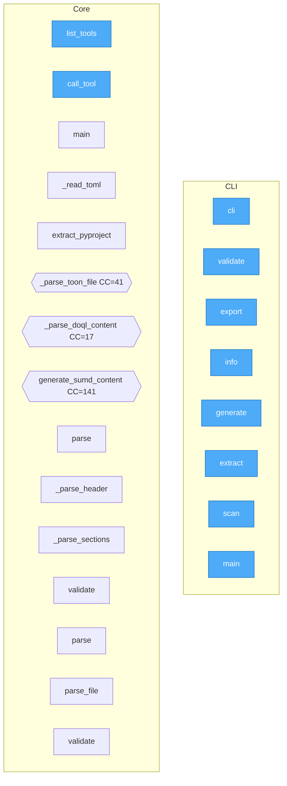
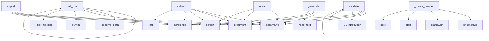

# SUMD

SUMD - Structured Unified Markdown Descriptor for AI-aware project documentation

## Metadata

- **name**: `sumd`
- **version**: `0.1.15`
- **python_requires**: `>=3.10`
- **license**: Apache-2.0
- **ai_model**: `openrouter/qwen/qwen3-coder-next`
- **ecosystem**: SUMD + DOQL + testql + taskfile
- **generated_from**: pyproject.toml, Taskfile.yml, app.doql.less, app.doql.css, goal.yaml, .env.example, src(4 mod), project/(12 analysis files)

## Intent

SUMD - Structured Unified Markdown Descriptor for AI-aware project documentation

## Architecture

```
SUMD (description) → DOQL/source (code) → taskfile (automation) → testql (verification)
```

### DOQL Application Declaration (`app.doql.less`, `app.doql.css`)

```less markpact:file path=app.doql.less
// LESS format — define @variables here as needed

app {
  name: sumd;
  version: 0.1.15;
}

interface[type="cli"] {
  framework: click;
}
interface[type="cli"] page[name="sumd"] {

}

workflow[name="install"] {
  trigger: manual;
  step-1: run cmd=pip install -e .[dev];
}

workflow[name="quality"] {
  trigger: manual;
  step-1: run cmd=pyqual run;
}

workflow[name="quality:fix"] {
  trigger: manual;
  step-1: run cmd=pyqual run --fix;
}

workflow[name="quality:report"] {
  trigger: manual;
  step-1: run cmd=pyqual report;
}

workflow[name="test"] {
  trigger: manual;
  step-1: run cmd=pytest -q;
}

workflow[name="lint"] {
  trigger: manual;
  step-1: run cmd=ruff check .;
}

workflow[name="fmt"] {
  trigger: manual;
  step-1: run cmd=ruff format .;
}

workflow[name="build"] {
  trigger: manual;
  step-1: run cmd=python -m build;
}

workflow[name="clean"] {
  trigger: manual;
  step-1: run cmd=rm -rf build/ dist/ *.egg-info;
}

workflow[name="structure"] {
  trigger: manual;
  step-1: run cmd=echo "📁 Analyzing sumd project structure..."
{{.DOQL_CMD}} adopt {{.PWD}} --output app.doql.css --force
echo "🎨 Exporting to LESS format..."
{{.DOQL_CMD}} export --format less -o {{.DOQL_OUTPUT}}
echo "✅ Structure generated: app.doql.css + {{.DOQL_OUTPUT}}";
}

workflow[name="doql:adopt"] {
  trigger: manual;
  step-1: run cmd={{.DOQL_CMD}} adopt {{.PWD}} --output app.doql.css --force;
  step-2: run cmd=echo "✅ Captured in app.doql.css";
}

workflow[name="doql:export"] {
  trigger: manual;
  step-1: run cmd=if [ ! -f "app.doql.css" ]; then
echo "❌ app.doql.css not found. Run: task structure"
exit 1
fi;
  step-2: run cmd={{.DOQL_CMD}} export --format less -o {{.DOQL_OUTPUT}};
  step-3: run cmd=echo "✅ Exported to {{.DOQL_OUTPUT}}";
}

workflow[name="doql:validate"] {
  trigger: manual;
  step-1: run cmd=if [ ! -f "{{.DOQL_OUTPUT}}" ]; then
echo "❌ {{.DOQL_OUTPUT}} not found. Run: task structure"
exit 1
fi;
  step-2: run cmd={{.DOQL_CMD}} validate;
}

workflow[name="doql:doctor"] {
  trigger: manual;
  step-1: run cmd={{.DOQL_CMD}} doctor;
}

workflow[name="doql:build"] {
  trigger: manual;
  step-1: run cmd=if [ ! -f "{{.DOQL_OUTPUT}}" ]; then
echo "❌ {{.DOQL_OUTPUT}} not found. Run: task structure"
exit 1
fi;
  step-2: run cmd=# Regenerate LESS from CSS if CSS exists
if [ -f "app.doql.css" ]; then
{{.DOQL_CMD}} export --format less -o {{.DOQL_OUTPUT}}
fi;
  step-3: run cmd={{.DOQL_CMD}} build app.doql.css --out build/;
}

workflow[name="docs:build"] {
  trigger: manual;
  step-1: run cmd=echo "Building SUMD documentation...";
  step-2: run cmd=python -m sumd.cli docs/ docs/;
}

workflow[name="help"] {
  trigger: manual;
  step-1: run cmd=task --list;
}

deploy {
  target: docker-compose;
}

environment[name="local"] {
  runtime: docker-compose;
  env_file: .env;
}
```

```css markpact:file path=app.doql.css
app {
  name: "sumd";
  version: "0.1.15";
}

interface[type="cli"] {
  framework: click;
}
interface[type="cli"] page[name="sumd"] {

}

workflow[name="install"] {
  trigger: "manual";
  step-1: run cmd=pip install -e .[dev];
}

workflow[name="quality"] {
  trigger: "manual";
  step-1: run cmd=pyqual run;
}

workflow[name="quality:fix"] {
  trigger: "manual";
  step-1: run cmd=pyqual run --fix;
}

workflow[name="quality:report"] {
  trigger: "manual";
  step-1: run cmd=pyqual report;
}

workflow[name="test"] {
  trigger: "manual";
  step-1: run cmd=pytest -q;
}

workflow[name="lint"] {
  trigger: "manual";
  step-1: run cmd=ruff check .;
}

workflow[name="fmt"] {
  trigger: "manual";
  step-1: run cmd=ruff format .;
}

workflow[name="build"] {
  trigger: "manual";
  step-1: run cmd=python -m build;
}

workflow[name="clean"] {
  trigger: "manual";
  step-1: run cmd=rm -rf build/ dist/ *.egg-info;
}

workflow[name="structure"] {
  trigger: "manual";
  step-1: run cmd=echo "📁 Analyzing sumd project structure..."
{{.DOQL_CMD}} adopt {{.PWD}} --output app.doql.css --force
echo "🎨 Exporting to LESS format..."
{{.DOQL_CMD}} export --format less -o {{.DOQL_OUTPUT}}
echo "✅ Structure generated: app.doql.css + {{.DOQL_OUTPUT}}";
}

workflow[name="doql:adopt"] {
  trigger: "manual";
  step-1: run cmd={{.DOQL_CMD}} adopt {{.PWD}} --output app.doql.css --force;
  step-2: run cmd=echo "✅ Captured in app.doql.css";
}

workflow[name="doql:export"] {
  trigger: "manual";
  step-1: run cmd=if [ ! -f "app.doql.css" ]; then
  echo "❌ app.doql.css not found. Run: task structure"
  exit 1
fi;
  step-2: run cmd={{.DOQL_CMD}} export --format less -o {{.DOQL_OUTPUT}};
  step-3: run cmd=echo "✅ Exported to {{.DOQL_OUTPUT}}";
}

workflow[name="doql:validate"] {
  trigger: "manual";
  step-1: run cmd=if [ ! -f "{{.DOQL_OUTPUT}}" ]; then
  echo "❌ {{.DOQL_OUTPUT}} not found. Run: task structure"
  exit 1
fi;
  step-2: run cmd={{.DOQL_CMD}} validate;
}

workflow[name="doql:doctor"] {
  trigger: "manual";
  step-1: run cmd={{.DOQL_CMD}} doctor;
}

workflow[name="doql:build"] {
  trigger: "manual";
  step-1: run cmd=if [ ! -f "{{.DOQL_OUTPUT}}" ]; then
  echo "❌ {{.DOQL_OUTPUT}} not found. Run: task structure"
  exit 1
fi;
  step-2: run cmd=# Regenerate LESS from CSS if CSS exists
if [ -f "app.doql.css" ]; then
  {{.DOQL_CMD}} export --format less -o {{.DOQL_OUTPUT}}
fi;
  step-3: run cmd={{.DOQL_CMD}} build app.doql.css --out build/;
}

workflow[name="docs:build"] {
  trigger: "manual";
  step-1: run cmd=echo "Building SUMD documentation...";
  step-2: run cmd=python -m sumd.cli docs/ docs/;
}

workflow[name="help"] {
  trigger: "manual";
  step-1: run cmd=task --list;
}

deploy {
  target: docker-compose;
}

environment[name="local"] {
  runtime: docker-compose;
  env_file: ".env";
}
```

### Source Modules

- `sumd.cli`
- `sumd.generator`
- `sumd.mcp_server`
- `sumd.parser`

## Interfaces

### CLI Entry Points

- `sumd`
- `sumd-mcp`

## Workflows

### Taskfile Tasks (`Taskfile.yml`)

```yaml markpact:file path=Taskfile.yml
# Taskfile.yml — sumd (Structured Unified Markdown Descriptor) project runner
# https://taskfile.dev

version: "3"

vars:
  APP_NAME: sumd
  DOQL_OUTPUT: app.doql.less
  DOQL_CMD: "{{if eq OS \"windows\"}}doql.exe{{else}}doql{{end}}"

env:
  PYTHONPATH: "{{.PWD}}"

tasks:
  # ─────────────────────────────────────────────────────────────────────────────
  # Development
  # ─────────────────────────────────────────────────────────────────────────────

  install:
    desc: Install Python dependencies (editable)
    cmds:
      - pip install -e .[dev]

  quality:
    desc: Run pyqual quality pipeline
    cmds:
      - pyqual run

  quality:fix:
    desc: Run pyqual with auto-fix
    cmds:
      - pyqual run --fix

  quality:report:
    desc: Generate pyqual quality report
    cmds:
      - pyqual report

  test:
    desc: Run pytest suite
    cmds:
      - pytest -q

  lint:
    desc: Run ruff lint check
    cmds:
      - ruff check .

  fmt:
    desc: Auto-format with ruff
    cmds:
      - ruff format .

  build:
    desc: Build wheel + sdist
    cmds:
      - python -m build

  clean:
    desc: Remove build artefacts
    cmds:
      - rm -rf build/ dist/ *.egg-info

  all:
    desc: Run install, quality check
    cmds:
      - task: install
      - task: quality

  # ─────────────────────────────────────────────────────────────────────────────
  # Doql Integration
  # ─────────────────────────────────────────────────────────────────────────────

  structure:
    desc: Generate project structure (app.doql.css + app.doql.less)
    cmds:
      - |
        echo "📁 Analyzing sumd project structure..."
        {{.DOQL_CMD}} adopt {{.PWD}} --output app.doql.css --force
        echo "🎨 Exporting to LESS format..."
        {{.DOQL_CMD}} export --format less -o {{.DOQL_OUTPUT}}
        echo "✅ Structure generated: app.doql.css + {{.DOQL_OUTPUT}}"

  doql:adopt:
    desc: Reverse-engineer sumd project structure (CSS only)
    cmds:
      - "{{.DOQL_CMD}} adopt {{.PWD}} --output app.doql.css --force"
      - echo "✅ Captured in app.doql.css"

  doql:export:
    desc: Export to LESS format
    cmds:
      - |
        if [ ! -f "app.doql.css" ]; then
          echo "❌ app.doql.css not found. Run: task structure"
          exit 1
        fi
      - "{{.DOQL_CMD}} export --format less -o {{.DOQL_OUTPUT}}"
      - echo "✅ Exported to {{.DOQL_OUTPUT}}"

  doql:validate:
    desc: Validate app.doql.less syntax
    cmds:
      - |
        if [ ! -f "{{.DOQL_OUTPUT}}" ]; then
          echo "❌ {{.DOQL_OUTPUT}} not found. Run: task structure"
          exit 1
        fi
      - "{{.DOQL_CMD}} validate"

  doql:doctor:
    desc: Run doql health checks
    cmds:
      - "{{.DOQL_CMD}} doctor"

  doql:build:
    desc: Generate code from app.doql.less
    cmds:
      - |
        if [ ! -f "{{.DOQL_OUTPUT}}" ]; then
          echo "❌ {{.DOQL_OUTPUT}} not found. Run: task structure"
          exit 1
        fi
      - |
        # Regenerate LESS from CSS if CSS exists
        if [ -f "app.doql.css" ]; then
          {{.DOQL_CMD}} export --format less -o {{.DOQL_OUTPUT}}
        fi
      - "{{.DOQL_CMD}} build app.doql.css --out build/"

  analyze:
    desc: Full doql analysis (structure + validate + doctor)
    cmds:
      - task: structure
      - task: doql:validate
      - task: doql:doctor

  # ─────────────────────────────────────────────────────────────────────────────
  # Documentation
  # ─────────────────────────────────────────────────────────────────────────────

  docs:build:
    desc: Build documentation
    cmds:
      - echo "Building SUMD documentation..."
      - python -m sumd.cli docs/ docs/

  # ─────────────────────────────────────────────────────────────────────────────
  # Utility
  # ─────────────────────────────────────────────────────────────────────────────

  help:
    desc: Show available tasks
    cmds:
      - task --list
```

## Configuration

```yaml
project:
  name: sumd
  version: 0.1.15
  env: local
```

## Dependencies

### Runtime

```text markpact:deps python
click>=8.0
pyyaml>=6.0
toml>=0.10.0
```

## Deployment

```bash markpact:run
pip install sumd

# development install
pip install -e .[dev]
```

## Environment Variables (`.env.example`)

| Variable | Default | Description |
|----------|---------|-------------|
| `OPENROUTER_API_KEY` | `*(not set)*` | Required: OpenRouter API key (https://openrouter.ai/keys) |
| `LLM_MODEL` | `openrouter/qwen/qwen3-coder-next` | Model (default: openrouter/qwen/qwen3-coder-next) |
| `PFIX_AUTO_APPLY` | `true` | true = apply fixes without asking |
| `PFIX_AUTO_INSTALL_DEPS` | `true` | true = auto pip/uv install |
| `PFIX_AUTO_RESTART` | `false` | true = os.execv restart after fix |
| `PFIX_MAX_RETRIES` | `3` |  |
| `PFIX_DRY_RUN` | `false` |  |
| `PFIX_ENABLED` | `true` |  |
| `PFIX_GIT_COMMIT` | `false` | true = auto-commit fixes |
| `PFIX_GIT_PREFIX` | `pfix:` | commit message prefix |
| `PFIX_CREATE_BACKUPS` | `false` | false = disable .pfix_backups/ directory |

## Release Management (`goal.yaml`)

- **versioning**: `semver`
- **commits**: `conventional` scope=`statement`
- **changelog**: `keep-a-changelog`
- **build strategies**: `python`, `nodejs`, `rust`
- **version files**: `VERSION`, `pyproject.toml:version`, `sumd/__init__.py:__version__`

## Code Analysis

### `project/analysis.toon.yaml`

```toon markpact:file path=project/analysis.toon.yaml
# code2llm | 7f 1993L | python:6,shell:1 | 2026-04-18
# CC̄=9.9 | critical:5/41 | dups:0 | cycles:0

HEALTH[5]:
  🟡 CC    scan CC=16 (limit:15)
  🟡 CC    call_tool CC=24 (limit:15)
  🟡 CC    _parse_toon_file CC=41 (limit:15)
  🟡 CC    _parse_doql_content CC=17 (limit:15)
  🟡 CC    generate_sumd_content CC=141 (limit:15)

REFACTOR[1]:
  1. split 5 high-CC methods  (CC>15)

PIPELINES[17]:
  [1] Src [validate]: validate → parse_file
      PURITY: 100% pure
  [2] Src [export]: export → parse_file
      PURITY: 100% pure
  [3] Src [info]: info → parse_file
      PURITY: 100% pure
  [4] Src [generate]: generate
      PURITY: 100% pure
  [5] Src [extract]: extract → parse_file
      PURITY: 100% pure

LAYERS:
  sumd/                           CC̄=9.9    ←in:0  →out:0
  │ !! generator                 1077L  0C   19m  CC=141    ←1
  │ !! mcp_server                 321L  0C    5m  CC=24     ←0
  │ !! cli                        291L  0C    8m  CC=16     ←0
  │ parser                     224L  4C    9m  CC=9      ←2
  │ __init__                    25L  0C    0m  CC=0.0    ←0
  │
  ./                              CC̄=0.0    ←in:0  →out:0
  │ project.sh                  35L  0C    0m  CC=0.0    ←0
  │
  scripts/                        CC̄=0.0    ←in:0  →out:0
  │ generate_all_sumd           20L  0C    0m  CC=0.0    ←0
  │

COUPLING: no cross-package imports detected

EXTERNAL:
  validation: run `vallm batch .` → validation.toon
  duplication: run `redup scan .` → duplication.toon
```

### `project/project.toon.yaml`

```toon markpact:file path=project/project.toon.yaml
# sumd | 41 func | 4f | 2106L | python | 2026-04-18

HEALTH:
  CC̄=9.9  critical=10 (limit:10)  dup=0  cycles=0

ALERTS[18]:
  !!! cc_exceeded      generate_sumd_content = 141 (limit:15)
  !!! high_fan_out     generate_sumd_content = 48 (limit:10)
  !!! cc_exceeded      _parse_toon_file = 41 (limit:15)
  !!! high_fan_out     scan = 24 (limit:10)
  !!! high_fan_out     _parse_doql_content = 23 (limit:10)
  !!! high_fan_out     call_tool = 20 (limit:10)
  !!  cc_exceeded      call_tool = 24 (limit:15)
  !!  high_fan_out     _parse_toon_file = 18 (limit:10)
  !!  high_fan_out     generate = 17 (limit:10)
  !!  high_fan_out     extract_openapi = 16 (limit:10)

MODULES[7] (top by size):
  M[sumd/generator.py] 1077L C:0 F:19 CC↑141 D:1 (python)
  M[sumd/mcp_server.py] 321L C:0 F:5 CC↑24 D:0 (python)
  M[sumd/cli.py] 291L C:0 F:8 CC↑16 D:0 (python)
  M[sumd/parser.py] 224L C:4 F:9 CC↑9 D:2 (python)
  M[project.sh] 35L C:0 F:0 CC↑0 D:0 (shell)
  M[sumd/__init__.py] 25L C:0 F:0 CC↑0 D:0 (python)
  M[scripts/generate_all_sumd.py] 20L C:0 F:0 CC↑0 D:0 (python)
  LANGS: python:6/shell:1

HOTSPOTS[10]:
  ★ generate_sumd_content fan=48  // Generate SUMD.md content from a project directory.

Args:
    proj_dir: Path to 
  ★ scan fan=24  // Scan a workspace directory and generate SUMD.md for every project found.

Detect
  ★ _parse_doql_content fan=23  // Parse DOQL content from .less or .css file into structured data.
  ★ call_tool fan=20  // Orchestrates 20 calls
  ★ _parse_toon_file fan=18  // Parse a single *.testql.toon.yaml file into a scenario dict.

REFACTOR[9]:
  [1] H/L Split _parse_toon_file (CC=41 → target CC<10)
  [2] H/L Split generate_sumd_content (CC=141 → target CC<10)
  [3] H/H Split god module sumd/generator.py (1077L, 0 classes)
  [4] M/L Split scan (CC=16 → target CC<10)
  [5] M/L Split call_tool (CC=24 → target CC<10)

EVOLUTION:
  2026-04-18 CC̄=9.9 crit=10 2106L // Automated analysis
```

### `project/evolution.toon.yaml`

```toon markpact:file path=project/evolution.toon.yaml
# code2llm/evolution | 41 func | 4f | 2026-04-18

NEXT[6] (ranked by impact):
  [1] !! SPLIT           sumd/generator.py
      WHY: 1077L, 0 classes, max CC=141
      EFFORT: ~4h  IMPACT: 151857

  [2] !! SPLIT-FUNC      generate_sumd_content  CC=141  fan=48
      WHY: CC=141 exceeds 15
      EFFORT: ~1h  IMPACT: 6768

  [3] !! SPLIT-FUNC      _parse_toon_file  CC=41  fan=18
      WHY: CC=41 exceeds 15
      EFFORT: ~1h  IMPACT: 738

  [4] !  SPLIT-FUNC      call_tool  CC=24  fan=20
      WHY: CC=24 exceeds 15
      EFFORT: ~1h  IMPACT: 480

  [5] !  SPLIT-FUNC      _parse_doql_content  CC=17  fan=23
      WHY: CC=17 exceeds 15
      EFFORT: ~1h  IMPACT: 391

  [6] !  SPLIT-FUNC      scan  CC=16  fan=24
      WHY: CC=16 exceeds 15
      EFFORT: ~1h  IMPACT: 384


RISKS[1]:
  ⚠ Splitting sumd/generator.py may break 19 import paths

METRICS-TARGET:
  CC̄:          9.9 → ≤5.0
  max-CC:      141 → ≤20
  god-modules: 1 → 0
  high-CC(≥15): 5 → ≤2
  hub-types:   0 → ≤0

PATTERNS (language parser shared logic):
  _extract_declarations() in base.py — unified extraction for:
    - TypeScript: interfaces, types, classes, functions, arrow funcs
    - PHP: namespaces, traits, classes, functions, includes
    - Ruby: modules, classes, methods, requires
    - C++: classes, structs, functions, #includes
    - C#: classes, interfaces, methods, usings
    - Java: classes, interfaces, methods, imports
    - Go: packages, functions, structs
    - Rust: modules, functions, traits, use statements

  Shared regex patterns per language:
    - import: language-specific import/require/using patterns
    - class: class/struct/trait declarations with inheritance
    - function: function/method signatures with visibility
    - brace_tracking: for C-family languages ({ })
    - end_keyword_tracking: for Ruby (module/class/def...end)

  Benefits:
    - Consistent extraction logic across all languages
    - Reduced code duplication (~70% reduction in parser LOC)
    - Easier maintenance: fix once, apply everywhere
    - Standardized FunctionInfo/ClassInfo models

HISTORY:
  (first run — no previous data)
```

### `project/map.toon.yaml`

```toon markpact:file path=project/map.toon.yaml
# sumd | 11f 3345L | python:8,css:1,less:1,shell:1 | 2026-04-18
# stats: 63 func | 5 cls | 11 mod | CC̄=9.9 | critical:17 | cycles:0
# alerts[5]: CC generate_sumd_content=148; CC _parse_toon_file=41; CC scan=37; CC generate_map_toon=32; CC call_tool=24
# hotspots[5]: generate_sumd_content fan=31; scaffold fan=30; scan fan=25; generate_map_toon fan=24; lint fan=17
# evolution: baseline
# Keys: M=modules, D=details, i=imports, e=exports, c=classes, f=functions, m=methods
M[11]:
  app.doql.css,129
  app.doql.less,131
  project.sh,35
  scripts/generate_all_sumd.py,21
  sumd/__init__.py,34
  sumd/cli.py,713
  sumd/generator.py,1383
  sumd/mcp_server.py,322
  sumd/parser.py,462
  tests/test_parser.py,103
  tests/test_statement.py,12
D:
  scripts/generate_all_sumd.py:
  sumd/__init__.py:
  sumd/cli.py:
    e: cli,validate,export,info,generate,extract,scan,lint,analyze,scaffold,map_cmd,main
    cli()
    validate(file)
    export(file;format;output)
    info(file)
    generate(file;format;output)
    extract(file;section)
    scan(workspace;export_json;report;fix;raw;analyze;tools)
    lint(files;workspace;as_json)
    analyze(project;tools;force)
    scaffold(project;output;force;scenario_type)
    map_cmd(project;output;force;stdout)
    main()
  sumd/generator.py:
    e: _read_toml,extract_pyproject,extract_taskfile,_parse_toon_file,extract_testql_scenarios,extract_openapi,_parse_doql_content,extract_doql,extract_pyqual,extract_python_modules,extract_readme_title,extract_requirements,extract_makefile,extract_goal,extract_env,extract_dockerfile,extract_docker_compose,extract_package_json,_lang_of,_fan_out,_cc_estimate,_try_radon_cc,_analyse_py_module,generate_map_toon,extract_project_analysis,generate_sumd_content
    _read_toml(path)
    extract_pyproject(proj_dir)
    extract_taskfile(proj_dir)
    _parse_toon_file(f)
    extract_testql_scenarios(proj_dir)
    extract_openapi(proj_dir)
    _parse_doql_content(content)
    extract_doql(proj_dir)
    extract_pyqual(proj_dir)
    extract_python_modules(proj_dir;pkg_name)
    extract_readme_title(proj_dir)
    extract_requirements(proj_dir)
    extract_makefile(proj_dir)
    extract_goal(proj_dir)
    extract_env(proj_dir)
    extract_dockerfile(proj_dir)
    extract_docker_compose(proj_dir)
    extract_package_json(proj_dir)
    _lang_of(path)
    _fan_out(func_node)
    _cc_estimate(func_node)
    _try_radon_cc(src)
    _analyse_py_module(path)
    generate_map_toon(proj_dir)
    extract_project_analysis(proj_dir)
    generate_sumd_content(proj_dir;return_sources;raw_sources)
  sumd/mcp_server.py:
    e: _doc_to_dict,_resolve_path,list_tools,call_tool,main
    _doc_to_dict(doc)
    _resolve_path(path)
    list_tools()
    call_tool(name;arguments)
    main()
  sumd/parser.py:
    e: SectionType,Section,SUMDDocument,SUMDParser,parse,parse_file,validate,CodeBlockIssue,_validate_yaml_body,_validate_less_css_body,_validate_mermaid_body,_validate_toon_body,_validate_bash_body,_validate_deps_body,validate_codeblocks,validate_markdown,validate_sumd_file
    SectionType:  # SUMD section types.
    Section:  # Represents a SUMD section.
    SUMDDocument:  # Represents a parsed SUMD document.
    SUMDParser: __init__(0),parse(1),parse_file(1),_parse_header(1),_parse_sections(1),validate(1)  # Parser for SUMD markdown documents.
    CodeBlockIssue:
    parse(content)
    parse_file(path)
    validate(document)
    _validate_yaml_body(body;path)
    _validate_less_css_body(body;path)
    _validate_mermaid_body(body;path)
    _validate_toon_body(body;path)
    _validate_bash_body(body;path)
    _validate_deps_body(body;path)
    validate_codeblocks(content;source)
    validate_markdown(content;source)
    validate_sumd_file(path)
  tests/test_parser.py:
    e: test_parse_basic,test_parse_sections,test_validate_valid_document,test_validate_missing_intent,test_parse_file,test_parser_class
    test_parse_basic()
    test_parse_sections()
    test_validate_valid_document()
    test_validate_missing_intent()
    test_parse_file(tmp_path)
    test_parser_class()
  tests/test_statement.py:
    e: test_placeholder,test_import
    test_placeholder()
    test_import()
```

### `project/duplication.toon.yaml`

```toon markpact:file path=project/duplication.toon.yaml
# redup/duplication | 1 groups | 6f 1958L | 2026-04-18

SUMMARY:
  files_scanned: 6
  total_lines:   1958
  dup_groups:    1
  dup_fragments: 2
  saved_lines:   11
  scan_ms:       4030

HOTSPOTS[1] (files with most duplication):
  sumd/parser.py  dup=22L  groups=1  frags=2  (1.1%)

DUPLICATES[1] (ranked by impact):
  [d1ab1a804f1b435b]   STRU  parse  L=11 N=2 saved=11 sim=1.00
      sumd/parser.py:188-198  (parse)
      sumd/parser.py:201-211  (parse_file)

REFACTOR[1] (ranked by priority):
  [1] ○ extract_function   → sumd/utils/parse.py
      WHY: 2 occurrences of 11-line block across 1 files — saves 11 lines
      FILES: sumd/parser.py

QUICK_WINS[1] (low risk, high savings — do first):
  [1] extract_function   saved=11L  → sumd/utils/parse.py
      FILES: parser.py

EFFORT_ESTIMATE (total ≈ 0.4h):
  easy   parse                               saved=11L  ~22min

METRICS-TARGET:
  dup_groups:  1 → 0
  saved_lines: 11 lines recoverable
```

### `project/validation.toon.yaml`

```toon markpact:file path=project/validation.toon.yaml
# vallm batch | 33f | 10✓ 0⚠ 4✗ | 2026-04-18

SUMMARY:
  scanned: 33  passed: 10 (30.3%)  warnings: 0  errors: 4  unsupported: 19

ERRORS[4]{path,score}:
  sumd/mcp_server.py,0.86
    issues[4]{rule,severity,message,line}:
      python.import.resolvable,error,Module 'mcp.server.stdio' not found,20
      python.import.resolvable,error,Module 'mcp.types' not found,21
      python.import.resolvable,error,Module 'mcp.server' not found,22
      python.import.resolvable,error,Module 'toml' not found,225
  tests/test_parser.py,0.86
    issues[1]{rule,severity,message,line}:
      python.import.resolvable,error,Module 'pytest' not found,3
  sumd/cli.py,0.93
    issues[2]{rule,severity,message,line}:
      python.import.resolvable,error,Module 'toml' not found,136
      python.import.resolvable,error,Module 'toml' not found,82
  sumd/generator.py,0.94
    issues[1]{rule,severity,message,line}:
      python.import.resolvable,error,Module 'toml' not found,55

UNSUPPORTED[4]{bucket,count}:
  *.md,9
  *.txt,1
  *.yml,1
  other,8
```

### `project/compact_flow.mmd`



### `project/calls.mmd`



### `project/flow.mmd`



### `project/context.md`

# System Architecture Analysis

## Overview

- **Project**: /home/tom/github/oqlos/sumd
- **Primary Language**: python
- **Languages**: python: 6, shell: 1
- **Analysis Mode**: static
- **Total Functions**: 41
- **Total Classes**: 4
- **Modules**: 7
- **Entry Points**: 18

## Architecture by Module

### sumd.generator
- **Functions**: 19
- **File**: `generator.py`

### sumd.parser
- **Functions**: 9
- **Classes**: 4
- **File**: `parser.py`

### sumd.cli
- **Functions**: 8
- **File**: `cli.py`

### sumd.mcp_server
- **Functions**: 5
- **File**: `mcp_server.py`

## Key Entry Points

Main execution flows into the system:

### sumd.mcp_server.call_tool
- **Calls**: server.call_tool, sumd.mcp_server._resolve_path, sumd.parser.SUMDParser.parse_file, json.dumps, sumd.mcp_server._doc_to_dict, types.TextContent, sumd.mcp_server._resolve_path, sumd.parser.SUMDParser.parse_file

### sumd.cli.scan
> Scan a workspace directory and generate SUMD.md for every project found.

Detects projects by presence of pyproject.toml. Extracts metadata from:
pypr
- **Calls**: cli.command, click.argument, click.option, click.option, click.option, click.option, workspace.resolve, SUMDParser

### sumd.cli.generate
> Generate a SUMD document from structured format.

FILE: Path to the structured format file (json/yaml/toml)
- **Calls**: cli.command, click.argument, click.option, click.option, file.read_text, lines.append, data.get, lines.append

### sumd.cli.export
> Export a SUMD document to structured format.

FILE: Path to the SUMD markdown file
- **Calls**: cli.command, click.argument, click.option, click.option, sumd.parser.SUMDParser.parse_file, click.Path, click.Choice, click.Path

### sumd.parser.SUMDParser._parse_header
> Parse the project header (H1).

Args:
    lines: List of document lines
- **Calls**: enumerate, line.startswith, None.strip, header_content.split, None.strip, line.startswith, len, None.strip

### sumd.cli.validate
> Validate a SUMD document.

FILE: Path to the SUMD markdown file
- **Calls**: cli.command, click.argument, sumd.parser.SUMDParser.parse_file, SUMDParser, parser.validate, click.Path, click.echo, sys.exit

### sumd.cli.extract
> Extract content from a SUMD document.

FILE: Path to the SUMD markdown file
- **Calls**: cli.command, click.argument, click.option, sumd.parser.SUMDParser.parse_file, click.Path, click.echo, sys.exit, click.echo

### sumd.parser.SUMDParser._parse_sections
> Parse all sections in the document.

Args:
    lines: List of document lines
- **Calls**: line.startswith, None.strip, sections.append, None.lower, self.SECTION_MAPPING.get, Section, None.strip, sections.append

### sumd.cli.info
> Display information about a SUMD document.

FILE: Path to the SUMD markdown file
- **Calls**: cli.command, click.argument, sumd.parser.SUMDParser.parse_file, click.echo, click.echo, click.echo, click.Path, click.echo

### sumd.mcp_server.list_tools
- **Calls**: server.list_tools, types.Tool, types.Tool, types.Tool, types.Tool, types.Tool, types.Tool, types.Tool

### sumd.parser.SUMDParser.parse
> Parse a SUMD markdown document.

Args:
    content: The markdown content to parse
    
Returns:
    SUMDDocument: Parsed document structure
- **Calls**: SUMDDocument, content.split, self._parse_header, self._parse_sections

### sumd.parser.SUMDParser.validate
> Validate a SUMD document against the specification.

Args:
    document: The document to validate
    
Returns:
    List of validation errors (empty i
- **Calls**: errors.append, errors.append, errors.append, errors.append

### sumd.mcp_server.main
- **Calls**: mcp.server.stdio.stdio_server, server.run, server.create_initialization_options

### sumd.parser.parse
> Parse a SUMD markdown document.

Args:
    content: The markdown content to parse
    
Returns:
    SUMDDocument: Parsed document structure
- **Calls**: SUMDParser, parser.parse

### sumd.parser.parse_file
> Parse a SUMD file.

Args:
    path: Path to the SUMD markdown file
    
Returns:
    SUMDDocument: Parsed document structure
- **Calls**: SUMDParser, parser.parse_file

### sumd.parser.validate
> Validate a SUMD document.

Args:
    document: The document to validate
    
Returns:
    List of validation errors (empty if valid)
- **Calls**: SUMDParser, parser.validate

### sumd.cli.main
> Main entry point for the CLI.
- **Calls**: sumd.cli.cli

### sumd.parser.SUMDParser.__init__

## Process Flows

Key execution flows identified:

### Flow 1: call_tool
```
call_tool [sumd.mcp_server]
  └─> _resolve_path
  └─> _doc_to_dict
  └─ →> parse_file
```

### Flow 2: scan
```
scan [sumd.cli]
```

### Flow 3: generate
```
generate [sumd.cli]
```

### Flow 4: export
```
export [sumd.cli]
  └─ →> parse_file
```

### Flow 5: _parse_header
```
_parse_header [sumd.parser.SUMDParser]
```

### Flow 6: validate
```
validate [sumd.cli]
  └─ →> parse_file
```

### Flow 7: extract
```
extract [sumd.cli]
  └─ →> parse_file
```

### Flow 8: _parse_sections
```
_parse_sections [sumd.parser.SUMDParser]
```

### Flow 9: info
```
info [sumd.cli]
  └─ →> parse_file
```

### Flow 10: list_tools
```
list_tools [sumd.mcp_server]
```

## Key Classes

### sumd.parser.SUMDParser
> Parser for SUMD markdown documents.
- **Methods**: 6
- **Key Methods**: sumd.parser.SUMDParser.__init__, sumd.parser.SUMDParser.parse, sumd.parser.SUMDParser.parse_file, sumd.parser.SUMDParser._parse_header, sumd.parser.SUMDParser._parse_sections, sumd.parser.SUMDParser.validate

### sumd.parser.SectionType
> SUMD section types.
- **Methods**: 0
- **Inherits**: Enum

### sumd.parser.Section
> Represents a SUMD section.
- **Methods**: 0

### sumd.parser.SUMDDocument
> Represents a parsed SUMD document.
- **Methods**: 0

## Data Transformation Functions

Key functions that process and transform data:

### sumd.cli.validate
> Validate a SUMD document.

FILE: Path to the SUMD markdown file
- **Output to**: cli.command, click.argument, sumd.parser.SUMDParser.parse_file, SUMDParser, parser.validate

### sumd.generator._parse_toon_file
> Parse a single *.testql.toon.yaml file into a scenario dict.
- **Output to**: f.read_text, content.splitlines, re.findall, content.splitlines, content.splitlines

### sumd.generator._parse_doql_content
> Parse DOQL content from .less or .css file into structured data.
- **Output to**: re.search, re.finditer, re.finditer, re.finditer, re.finditer

### sumd.parser.SUMDParser.parse
> Parse a SUMD markdown document.

Args:
    content: The markdown content to parse
    
Returns:
    
- **Output to**: SUMDDocument, content.split, self._parse_header, self._parse_sections

### sumd.parser.SUMDParser.parse_file
> Parse a SUMD file.

Args:
    path: Path to the SUMD markdown file
    
Returns:
    SUMDDocument: P
- **Output to**: path.read_text, self.parse

### sumd.parser.SUMDParser._parse_header
> Parse the project header (H1).

Args:
    lines: List of document lines
- **Output to**: enumerate, line.startswith, None.strip, header_content.split, None.strip

### sumd.parser.SUMDParser._parse_sections
> Parse all sections in the document.

Args:
    lines: List of document lines
- **Output to**: line.startswith, None.strip, sections.append, None.lower, self.SECTION_MAPPING.get

### sumd.parser.SUMDParser.validate
> Validate a SUMD document against the specification.

Args:
    document: The document to validate
  
- **Output to**: errors.append, errors.append, errors.append, errors.append

### sumd.parser.parse
> Parse a SUMD markdown document.

Args:
    content: The markdown content to parse
    
Returns:
    
- **Output to**: SUMDParser, parser.parse

### sumd.parser.parse_file
> Parse a SUMD file.

Args:
    path: Path to the SUMD markdown file
    
Returns:
    SUMDDocument: P
- **Output to**: SUMDParser, parser.parse_file

### sumd.parser.validate
> Validate a SUMD document.

Args:
    document: The document to validate
    
Returns:
    List of va
- **Output to**: SUMDParser, parser.validate

## Public API Surface

Functions exposed as public API (no underscore prefix):

- `sumd.generator.generate_sumd_content` - 353 calls
- `sumd.mcp_server.call_tool` - 64 calls
- `sumd.cli.scan` - 48 calls
- `sumd.cli.generate` - 30 calls
- `sumd.generator.extract_openapi` - 24 calls
- `sumd.generator.extract_goal` - 24 calls
- `sumd.generator.extract_dockerfile` - 22 calls
- `sumd.generator.extract_docker_compose` - 22 calls
- `sumd.generator.extract_pyproject` - 17 calls
- `sumd.cli.export` - 16 calls
- `sumd.generator.extract_package_json` - 15 calls
- `sumd.cli.validate` - 13 calls
- `sumd.cli.extract` - 13 calls
- `sumd.generator.extract_taskfile` - 13 calls
- `sumd.generator.extract_env` - 13 calls
- `sumd.generator.extract_testql_scenarios` - 12 calls
- `sumd.generator.extract_pyqual` - 12 calls
- `sumd.generator.extract_makefile` - 12 calls
- `sumd.cli.info` - 11 calls
- `sumd.generator.extract_requirements` - 9 calls
- `sumd.mcp_server.list_tools` - 8 calls
- `sumd.generator.extract_readme_title` - 5 calls
- `sumd.generator.extract_doql` - 4 calls
- `sumd.generator.extract_python_modules` - 4 calls
- `sumd.parser.SUMDParser.parse` - 4 calls
- `sumd.parser.SUMDParser.validate` - 4 calls
- `sumd.mcp_server.main` - 3 calls
- `sumd.cli.cli` - 2 calls
- `sumd.parser.SUMDParser.parse_file` - 2 calls
- `sumd.parser.parse` - 2 calls
- `sumd.parser.parse_file` - 2 calls
- `sumd.parser.validate` - 2 calls
- `sumd.cli.main` - 1 calls

## System Interactions

How components interact:



## Reverse Engineering Guidelines

1. **Entry Points**: Start analysis from the entry points listed above
2. **Core Logic**: Focus on classes with many methods
3. **Data Flow**: Follow data transformation functions
4. **Process Flows**: Use the flow diagrams for execution paths
5. **API Surface**: Public API functions reveal the interface

## Context for LLM

Maintain the identified architectural patterns and public API surface when suggesting changes.

### `project/README.md`

# code2llm - Generated Analysis Files

This directory contains the complete analysis of your project generated by `code2llm`. Each file serves a specific purpose for understanding, refactoring, and documenting your codebase.

## 📁 Generated Files Overview

When you run `code2llm ./ -f all`, the following files are created:

### 🎯 Core Analysis Files

| File | Format | Purpose | Key Insights |
|------|--------|---------|--------------|
| `evolution.toon.yaml` | **YAML** | **📋 Refactoring queue** - Prioritized improvements | 0 refactoring actions needed |
| `map.toon.yaml` | **YAML** | **🗺️ Structural map + project header** - Modules, imports, exports, signatures, stats, alerts, hotspots, trend | Project architecture overview |

### 🤖 LLM-Ready Documentation

| File | Format | Purpose | Use Case |
|------|--------|---------|----------|
| `prompt.txt` | **Text** | **📝 Ready-to-send prompt** - Lists all files with instructions | Attach to LLM conversation as context guide |
| `context.md` | **Markdown** | **📖 LLM narrative** - Architecture summary | Paste into ChatGPT/Claude for code analysis |

### 📊 Visualizations

| File | Format | Purpose | Description |
|------|--------|---------|-------------|
| `flow.mmd` | **Mermaid** | **🔄 Control flow diagram** | Function call paths with complexity styling |
| `calls.mmd` | **Mermaid** | **📞 Call graph** | Function dependencies (edges only) |
| `compact_flow.mmd` | **Mermaid** | **📦 Module overview** | Aggregated module-level view |

## 🚀 Quick Start Commands

### Basic Analysis
```bash
# Quick health check (TOON format only)
code2llm ./ -f toon

# Generate all formats (what created these files)
code2llm ./ -f all

# LLM-ready context only
code2llm ./ -f context
```

### Performance Options
```bash
# Fast analysis for large projects
code2llm ./ -f toon --strategy quick

# Memory-limited analysis
code2llm ./ -f all --max-memory 500

# Skip PNG generation (faster)
code2llm ./ -f all --no-png
```

### Refactoring Focus
```bash
# Get refactoring recommendations
code2llm ./ -f evolution

# Focus on specific code smells
code2llm ./ -f toon --refactor --smell god_function

# Data flow analysis
code2llm ./ -f flow --data-flow
```

## 📖 Understanding Each File

### `analysis.toon` - Health Diagnostics
**Purpose**: Quick overview of code health issues
**Key sections**:
- **HEALTH**: Critical issues (🔴) and warnings (🟡)
- **REFACTOR**: Prioritized refactoring actions
- **COUPLING**: Module dependencies and potential cycles
- **LAYERS**: Package complexity metrics
- **FUNCTIONS**: High-complexity functions (CC ≥ 10)
- **CLASSES**: Complex classes needing attention

**Example usage**:
```bash
# View health issues
cat analysis.toon | head -30

# Check refactoring priorities
grep "REFACTOR" analysis.toon
```

### `evolution.toon.yaml` - Refactoring Queue
**Purpose**: Step-by-step refactoring plan
**Key sections**:
- **NEXT**: Immediate actions to take
- **RISKS**: Potential breaking changes
- **METRICS-TARGET**: Success criteria

**Example usage**:
```bash
# Get refactoring plan
cat evolution.toon.yaml

# Track progress
grep "NEXT" evolution.toon.yaml
```

### `flow.toon` - Legacy Data Flow Analysis
**Purpose**: Understand data movement through the system (legacy / explicit opt-in)
**Key sections**:
- **PIPELINES**: Data processing chains
- **CONTRACTS**: Function input/output contracts
- **SIDE_EFFECTS**: Functions with external impacts

**Example usage**:
```bash
# Find data pipelines
grep "PIPELINES" flow.toon

# Identify side effects
grep "SIDE_EFFECTS" flow.toon
```

### `map.toon.yaml` - Structural Map + Project Header
**Purpose**: High-level architecture overview plus compact project header
**Key sections**:
- **MODULES**: All modules with basic stats
- **IMPORTS**: Dependency relationships
- **EXPORTS**: Public API surface and signatures
- **HEADER**: Stats, alerts, hotspots, evolution trend

**Example usage**:
```bash
# See project structure
cat map.toon.yaml | head -50

# Find public APIs
grep "SIGNATURES" map.toon.yaml
```

### `project.toon.yaml` - Compact Analysis View
**Purpose**: Compact module view generated from project.yaml data
**Status**: Legacy view generated on demand from unified project.yaml

**Example usage**:
```bash
# View compact project structure
cat project.toon.yaml | head -30

# Find largest files
grep -E "^  .*[0-9]{3,}$" project.toon.yaml | sort -t',' -k2 -n -r | head -10
```

### `prompt.txt` - Ready-to-Send LLM Prompt
**Purpose**: Pre-formatted prompt listing all generated files for LLM conversation
**Generation**: Written when `code2llm` runs with a source path and requests `-f all` (including `--no-chunk`) or `code2logic`
**Contents**:
- **Files section**: Lists all existing generated files with descriptions, including `project.toon.yaml` when generated by `-f all`
- **Source files section**: Highlights important source files such as `cli_exports/orchestrator.py`
- **Missing section**: Shows which files weren't generated (if any)
- **Task section**: Refactoring brief with concrete execution instructions, not just analysis
- **Priority Order section**: State-dependent refactoring priorities, starting with blockers and then architecture cleanup
- **Requirements section**: Guidelines for suggested changes

**Example usage**:
```bash
# View the prompt
cat prompt.txt

# Copy to clipboard and paste into ChatGPT/Claude
cat prompt.txt | pbcopy  # macOS
cat prompt.txt | xclip -sel clip  # Linux
```

### `context.md` - LLM Narrative
**Purpose**: Ready-to-paste context for AI assistants
**Key sections**:
- **Overview**: Project statistics
- **Architecture**: Module breakdown
- **Entry Points**: Public interfaces
- **Patterns**: Design patterns detected

**Example usage**:
```bash
# Copy to clipboard for LLM
cat context.md | pbcopy  # macOS
cat context.md | xclip -sel clip  # Linux

# Use with Claude/ChatGPT for code analysis
```

### Visualization Files (`*.mmd`, `*.png`)
**Purpose**: Visual understanding of code structure
**Files**:
- `flow.mmd` - Detailed control flow with complexity colors
- `calls.mmd` - Simple call graph
- `compact_flow.mmd` - High-level module view
- `*.png` - Pre-rendered images

**Example usage**:
```bash
# View diagrams
open flow.png  # macOS
xdg-open flow.png  # Linux

# Edit in Mermaid Live Editor
# Copy content of .mmd files to https://mermaid.live
```

## 🔍 Common Analysis Patterns

### 1. Code Health Assessment
```bash
# Quick health check
code2llm ./ -f toon
cat analysis.toon | grep -E "(HEALTH|REFACTOR)"
```

### 2. Refactoring Planning
```bash
# Get refactoring queue
code2llm ./ -f evolution
cat evolution.toon.yaml

# Focus on specific issues
code2llm ./ -f toon --refactor --smell god_function
```

### 3. LLM Assistance
```bash
# Generate context for AI
code2llm ./ -f context
cat context.md

# Use with Claude: "Based on this context, help me refactor the god modules"
```

### 4. Team Documentation
```bash
# Generate all docs for team
code2llm ./ -f all -o ./docs/

# Create visual diagrams
open docs/flow.png
```

## 📊 Interpreting Metrics

### Complexity Metrics (CC)
- **🔴 Critical (≥5.0)**: Immediate refactoring needed
- **🟠 High (3.0-4.9)**: Consider refactoring
- **🟡 Medium (1.5-2.9)**: Monitor complexity
- **🟢 Low (0.1-1.4)**: Acceptable
- **⚪ Basic (0.0)**: Simple functions

### Module Health
- **GOD Module**: Too large (>500 lines, >20 methods)
- **HUB**: High fan-out (calls many modules)
- **FAN-IN**: High incoming dependencies
- **CYCLES**: Circular dependencies

### Data Flow Indicators
- **PIPELINE**: Sequential data processing
- **CONTRACT**: Clear input/output specification
- **SIDE_EFFECT**: External state modification

## 🛠️ Integration Examples

### CI/CD Pipeline
```bash
#!/bin/bash
# Analyze code quality in CI
code2llm ./ -f toon -o ./analysis
if grep -q "🔴 GOD" ./analysis/analysis.toon; then
    echo "❌ God modules detected"
    exit 1
fi
```

### Pre-commit Hook
```bash
#!/bin/sh
# .git/hooks/pre-commit
code2llm ./ -f toon -o ./temp_analysis
if grep -q "🔴" ./temp_analysis/analysis.toon; then
    echo "⚠️  Critical issues found. Review before committing."
fi
rm -rf ./temp_analysis
```

### Documentation Generation
```bash
# Generate docs for README
code2llm ./ -f context -o ./docs/
echo "## Architecture" >> README.md
cat docs/context.md >> README.md
```

## 📚 Next Steps

1. **Review `analysis.toon`** - Identify critical issues
2. **Check `evolution.toon.yaml`** - Plan refactoring priorities
3. **Use `context.md`** - Get LLM assistance for complex changes
4. **Reference visualizations** - Understand system architecture
5. **Track progress** - Re-run analysis after changes

## 🔧 Advanced Usage

### Custom Analysis
```bash
# Deep analysis with all insights
code2llm ./ -m hybrid -f all --max-depth 15 -v

# Performance-optimized
code2llm ./ -m static -f toon --strategy quick

# Refactoring-focused
code2llm ./ -f toon,evolution --refactor
```

### Output Customization
```bash
# Separate output directories
code2llm ./ -f all -o ./analysis-$(date +%Y%m%d)

# Split YAML into multiple files
code2llm ./ -f yaml --split-output

# Separate orphaned functions
code2llm ./ -f yaml --separate-orphans
```

---

**Generated by**: `code2llm ./ -f all --readme`  
**Analysis Date**: 2026-04-18  
**Total Functions**: 41  
**Total Classes**: 4  
**Modules**: 7  

For more information about code2llm, visit: https://github.com/tom-sapletta/code2llm

### `project/prompt.txt`

```text markpact:file path=project/prompt.txt
You are an AI assistant helping me understand and improve a codebase.
Use the attached/generated files as the authoritative context.
Your goal is to refactor the project based on these files, not just summarize it.

we are in project path: .

Files for analysis:

Note: project/validation.toon.yaml and project/duplication.toon.yaml are generated by external tools (vallm and redup)
- project/analysis.toon.yaml  (Health diagnostics - complexity metrics, god modules, coupling issues, refactoring priorities) [1KB]
- project/map.toon.yaml  (Structural map - files, sizes, imports, exports, signatures, project header) [2KB]
- project/evolution.toon.yaml  (Refactoring queue - ranked actions by impact/effort, risks, metrics targets, history) [2KB]
- project/project.toon.yaml  (Compact project overview - generated from project.yaml data) [1KB]
- project/context.md  (LLM narrative - architecture summary and project context) [10KB]

Missing files (not generated in this run):
- project/README.md

Task:
- Treat this prompt as a refactoring brief: identify the highest-priority changes and prepare concrete edits.
- Use the file set to decide whether the first pass should focus on correctness, duplication, complexity reduction, or architecture cleanup.
- If you can safely implement the refactor, do it; otherwise give an exact file-by-file change plan and test plan.
- Use analysis.toon.yaml to locate high-CC functions and god modules that should be split first.
- Keep module boundaries intact and update imports/exports according to map.toon.yaml.
- Use evolution.toon.yaml as the execution backlog and work from the top-ranked items.
- Keep project.toon.yaml aligned with the refactored architecture.

Priority Order:
P1 — Split or simplify the highest-CC / god modules identified in analysis.toon.yaml.
P1 — Preserve module boundaries and update imports/exports according to map.toon.yaml.
P2 — Keep the compact project overview in project.toon.yaml aligned with the refactor.
P2 — Execute the highest-impact items from evolution.toon.yaml in order of benefit/risk.

Focus Areas for Analysis:
1. **Code Health Analysis** - Review complexity metrics, god modules, coupling issues from analysis.toon.yaml
2. **Structural Map** - Use map.toon.yaml to inspect imports, exports, signatures, and the project header
3. **Refactoring Priorities** - Examine ranked refactoring actions and risk assessment from evolution.toon.yaml
4. **Project Overview** - Review the compact project overview from project.toon.yaml

Analysis Strategy:
- Start with analysis.toon.yaml for health metrics, then map.toon.yaml for structure and signatures
- Review evolution.toon.yaml for action priorities and next steps
- Compare the compact project overview in project.toon.yaml with the main analysis files

Constraints:
- Prefer minimal, incremental changes.
- Maintain full backward compatibility.
- Base recommendations on concrete metrics from the provided files.
- If uncertain, ask clarifying questions.
```
