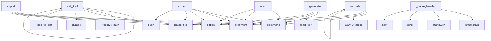

# System Architecture Analysis

## Overview

- **Project**: /home/tom/github/oqlos/sumd
- **Primary Language**: python
- **Languages**: python: 6, shell: 1
- **Analysis Mode**: static
- **Total Functions**: 41
- **Total Classes**: 4
- **Modules**: 7
- **Entry Points**: 18

## Architecture by Module

### sumd.generator
- **Functions**: 19
- **File**: `generator.py`

### sumd.parser
- **Functions**: 9
- **Classes**: 4
- **File**: `parser.py`

### sumd.cli
- **Functions**: 8
- **File**: `cli.py`

### sumd.mcp_server
- **Functions**: 5
- **File**: `mcp_server.py`

## Key Entry Points

Main execution flows into the system:

### sumd.mcp_server.call_tool
- **Calls**: server.call_tool, sumd.mcp_server._resolve_path, sumd.parser.SUMDParser.parse_file, json.dumps, sumd.mcp_server._doc_to_dict, types.TextContent, sumd.mcp_server._resolve_path, sumd.parser.SUMDParser.parse_file

### sumd.cli.scan
> Scan a workspace directory and generate SUMD.md for every project found.

Detects projects by presence of pyproject.toml. Extracts metadata from:
pypr
- **Calls**: cli.command, click.argument, click.option, click.option, click.option, click.option, workspace.resolve, SUMDParser

### sumd.cli.generate
> Generate a SUMD document from structured format.

FILE: Path to the structured format file (json/yaml/toml)
- **Calls**: cli.command, click.argument, click.option, click.option, file.read_text, lines.append, data.get, lines.append

### sumd.cli.export
> Export a SUMD document to structured format.

FILE: Path to the SUMD markdown file
- **Calls**: cli.command, click.argument, click.option, click.option, sumd.parser.SUMDParser.parse_file, click.Path, click.Choice, click.Path

### sumd.parser.SUMDParser._parse_header
> Parse the project header (H1).

Args:
    lines: List of document lines
- **Calls**: enumerate, line.startswith, None.strip, header_content.split, None.strip, line.startswith, len, None.strip

### sumd.cli.validate
> Validate a SUMD document.

FILE: Path to the SUMD markdown file
- **Calls**: cli.command, click.argument, sumd.parser.SUMDParser.parse_file, SUMDParser, parser.validate, click.Path, click.echo, sys.exit

### sumd.cli.extract
> Extract content from a SUMD document.

FILE: Path to the SUMD markdown file
- **Calls**: cli.command, click.argument, click.option, sumd.parser.SUMDParser.parse_file, click.Path, click.echo, sys.exit, click.echo

### sumd.parser.SUMDParser._parse_sections
> Parse all sections in the document.

Args:
    lines: List of document lines
- **Calls**: line.startswith, None.strip, sections.append, None.lower, self.SECTION_MAPPING.get, Section, None.strip, sections.append

### sumd.cli.info
> Display information about a SUMD document.

FILE: Path to the SUMD markdown file
- **Calls**: cli.command, click.argument, sumd.parser.SUMDParser.parse_file, click.echo, click.echo, click.echo, click.Path, click.echo

### sumd.mcp_server.list_tools
- **Calls**: server.list_tools, types.Tool, types.Tool, types.Tool, types.Tool, types.Tool, types.Tool, types.Tool

### sumd.parser.SUMDParser.parse
> Parse a SUMD markdown document.

Args:
    content: The markdown content to parse
    
Returns:
    SUMDDocument: Parsed document structure
- **Calls**: SUMDDocument, content.split, self._parse_header, self._parse_sections

### sumd.parser.SUMDParser.validate
> Validate a SUMD document against the specification.

Args:
    document: The document to validate
    
Returns:
    List of validation errors (empty i
- **Calls**: errors.append, errors.append, errors.append, errors.append

### sumd.mcp_server.main
- **Calls**: mcp.server.stdio.stdio_server, server.run, server.create_initialization_options

### sumd.parser.parse
> Parse a SUMD markdown document.

Args:
    content: The markdown content to parse
    
Returns:
    SUMDDocument: Parsed document structure
- **Calls**: SUMDParser, parser.parse

### sumd.parser.parse_file
> Parse a SUMD file.

Args:
    path: Path to the SUMD markdown file
    
Returns:
    SUMDDocument: Parsed document structure
- **Calls**: SUMDParser, parser.parse_file

### sumd.parser.validate
> Validate a SUMD document.

Args:
    document: The document to validate
    
Returns:
    List of validation errors (empty if valid)
- **Calls**: SUMDParser, parser.validate

### sumd.cli.main
> Main entry point for the CLI.
- **Calls**: sumd.cli.cli

### sumd.parser.SUMDParser.__init__

## Process Flows

Key execution flows identified:

### Flow 1: call_tool
```
call_tool [sumd.mcp_server]
  └─> _resolve_path
  └─> _doc_to_dict
  └─ →> parse_file
```

### Flow 2: scan
```
scan [sumd.cli]
```

### Flow 3: generate
```
generate [sumd.cli]
```

### Flow 4: export
```
export [sumd.cli]
  └─ →> parse_file
```

### Flow 5: _parse_header
```
_parse_header [sumd.parser.SUMDParser]
```

### Flow 6: validate
```
validate [sumd.cli]
  └─ →> parse_file
```

### Flow 7: extract
```
extract [sumd.cli]
  └─ →> parse_file
```

### Flow 8: _parse_sections
```
_parse_sections [sumd.parser.SUMDParser]
```

### Flow 9: info
```
info [sumd.cli]
  └─ →> parse_file
```

### Flow 10: list_tools
```
list_tools [sumd.mcp_server]
```

## Key Classes

### sumd.parser.SUMDParser
> Parser for SUMD markdown documents.
- **Methods**: 6
- **Key Methods**: sumd.parser.SUMDParser.__init__, sumd.parser.SUMDParser.parse, sumd.parser.SUMDParser.parse_file, sumd.parser.SUMDParser._parse_header, sumd.parser.SUMDParser._parse_sections, sumd.parser.SUMDParser.validate

### sumd.parser.SectionType
> SUMD section types.
- **Methods**: 0
- **Inherits**: Enum

### sumd.parser.Section
> Represents a SUMD section.
- **Methods**: 0

### sumd.parser.SUMDDocument
> Represents a parsed SUMD document.
- **Methods**: 0

## Data Transformation Functions

Key functions that process and transform data:

### sumd.cli.validate
> Validate a SUMD document.

FILE: Path to the SUMD markdown file
- **Output to**: cli.command, click.argument, sumd.parser.SUMDParser.parse_file, SUMDParser, parser.validate

### sumd.generator._parse_toon_file
> Parse a single *.testql.toon.yaml file into a scenario dict.
- **Output to**: f.read_text, content.splitlines, re.findall, content.splitlines, content.splitlines

### sumd.generator._parse_doql_content
> Parse DOQL content from .less or .css file into structured data.
- **Output to**: re.search, re.finditer, re.finditer, re.finditer, re.finditer

### sumd.parser.SUMDParser.parse
> Parse a SUMD markdown document.

Args:
    content: The markdown content to parse
    
Returns:
    
- **Output to**: SUMDDocument, content.split, self._parse_header, self._parse_sections

### sumd.parser.SUMDParser.parse_file
> Parse a SUMD file.

Args:
    path: Path to the SUMD markdown file
    
Returns:
    SUMDDocument: P
- **Output to**: path.read_text, self.parse

### sumd.parser.SUMDParser._parse_header
> Parse the project header (H1).

Args:
    lines: List of document lines
- **Output to**: enumerate, line.startswith, None.strip, header_content.split, None.strip

### sumd.parser.SUMDParser._parse_sections
> Parse all sections in the document.

Args:
    lines: List of document lines
- **Output to**: line.startswith, None.strip, sections.append, None.lower, self.SECTION_MAPPING.get

### sumd.parser.SUMDParser.validate
> Validate a SUMD document against the specification.

Args:
    document: The document to validate
  
- **Output to**: errors.append, errors.append, errors.append, errors.append

### sumd.parser.parse
> Parse a SUMD markdown document.

Args:
    content: The markdown content to parse
    
Returns:
    
- **Output to**: SUMDParser, parser.parse

### sumd.parser.parse_file
> Parse a SUMD file.

Args:
    path: Path to the SUMD markdown file
    
Returns:
    SUMDDocument: P
- **Output to**: SUMDParser, parser.parse_file

### sumd.parser.validate
> Validate a SUMD document.

Args:
    document: The document to validate
    
Returns:
    List of va
- **Output to**: SUMDParser, parser.validate

## Public API Surface

Functions exposed as public API (no underscore prefix):

- `sumd.generator.generate_sumd_content` - 353 calls
- `sumd.mcp_server.call_tool` - 64 calls
- `sumd.cli.scan` - 48 calls
- `sumd.cli.generate` - 30 calls
- `sumd.generator.extract_openapi` - 24 calls
- `sumd.generator.extract_goal` - 24 calls
- `sumd.generator.extract_dockerfile` - 22 calls
- `sumd.generator.extract_docker_compose` - 22 calls
- `sumd.generator.extract_pyproject` - 17 calls
- `sumd.cli.export` - 16 calls
- `sumd.generator.extract_package_json` - 15 calls
- `sumd.cli.validate` - 13 calls
- `sumd.cli.extract` - 13 calls
- `sumd.generator.extract_taskfile` - 13 calls
- `sumd.generator.extract_env` - 13 calls
- `sumd.generator.extract_testql_scenarios` - 12 calls
- `sumd.generator.extract_pyqual` - 12 calls
- `sumd.generator.extract_makefile` - 12 calls
- `sumd.cli.info` - 11 calls
- `sumd.generator.extract_requirements` - 9 calls
- `sumd.mcp_server.list_tools` - 8 calls
- `sumd.generator.extract_readme_title` - 5 calls
- `sumd.generator.extract_doql` - 4 calls
- `sumd.generator.extract_python_modules` - 4 calls
- `sumd.parser.SUMDParser.parse` - 4 calls
- `sumd.parser.SUMDParser.validate` - 4 calls
- `sumd.mcp_server.main` - 3 calls
- `sumd.cli.cli` - 2 calls
- `sumd.parser.SUMDParser.parse_file` - 2 calls
- `sumd.parser.parse` - 2 calls
- `sumd.parser.parse_file` - 2 calls
- `sumd.parser.validate` - 2 calls
- `sumd.cli.main` - 1 calls

## System Interactions

How components interact:



## Reverse Engineering Guidelines

1. **Entry Points**: Start analysis from the entry points listed above
2. **Core Logic**: Focus on classes with many methods
3. **Data Flow**: Follow data transformation functions
4. **Process Flows**: Use the flow diagrams for execution paths
5. **API Surface**: Public API functions reveal the interface

## Context for LLM

Maintain the identified architectural patterns and public API surface when suggesting changes.