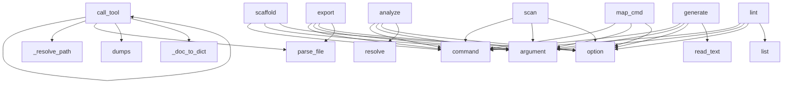

# System Architecture Analysis

## Overview

- **Project**: /home/tom/github/oqlos/sumd
- **Primary Language**: python
- **Languages**: python: 9, shell: 1
- **Analysis Mode**: static
- **Total Functions**: 104
- **Total Classes**: 5
- **Modules**: 10
- **Entry Points**: 28

## Architecture by Module

### sumd.extractor
- **Functions**: 28
- **File**: `extractor.py`

### sumd.parser
- **Functions**: 23
- **Classes**: 5
- **File**: `parser.py`

### sumd.cli
- **Functions**: 22
- **File**: `cli.py`

### sumd.renderer
- **Functions**: 18
- **File**: `renderer.py`

### sumd.toon_parser
- **Functions**: 8
- **File**: `toon_parser.py`

### sumd.mcp_server
- **Functions**: 5
- **File**: `mcp_server.py`

## Key Entry Points

Main execution flows into the system:

### sumd.mcp_server.call_tool
- **Calls**: server.call_tool, sumd.mcp_server._resolve_path, sumd.parser.SUMDParser.parse_file, json.dumps, sumd.mcp_server._doc_to_dict, types.TextContent, sumd.mcp_server._resolve_path, sumd.parser.SUMDParser.parse_file

### sumd.cli.analyze
> Run analysis tools (code2llm, redup, vallm) on a project.

Installs tools to .sumd-tools/venv and generates analysis files in project/.

PROJECT: Path
- **Calls**: cli.command, click.argument, click.option, click.option, project.resolve, click.echo, click.echo, sumd.cli._setup_tools_venv

### sumd.cli.scaffold
> Generate testql scenario scaffolds from OpenAPI spec or SUMD.md.

Reads openapi.yaml (if present) and generates .testql.toon.yaml scenario files
for e
- **Calls**: cli.command, click.argument, click.option, click.option, click.option, project.resolve, None.resolve, out_dir.mkdir

### sumd.cli.generate
> Generate a SUMD document from structured format.

FILE: Path to the structured format file (json/yaml/toml)
- **Calls**: cli.command, click.argument, click.option, click.option, file.read_text, lines.append, data.get, lines.append

### sumd.cli.lint
> Validate SUMD.md files — check markdown structure and codeblock formats.

Validates:
  - Markdown structure (H1, required H2 sections, metadata fields
- **Calls**: cli.command, click.argument, click.option, click.option, list, sys.exit, workspace.resolve, sorted

### sumd.cli.scan
> Scan a workspace directory and generate SUMD.md for every project found.

Detects projects by presence of pyproject.toml. Extracts metadata from:
pypr
- **Calls**: cli.command, click.argument, click.option, click.option, click.option, click.option, click.option, click.option

### sumd.cli.map_cmd
> Generate project/map.toon.yaml — static code map in toon format.

Analyses all source files in the project and produces a map.toon.yaml
with module in
- **Calls**: cli.command, click.argument, click.option, click.option, click.option, project.resolve, click.echo, sumd.extractor.generate_map_toon

### sumd.cli.export
> Export a SUMD document to structured format.

FILE: Path to the SUMD markdown file
- **Calls**: cli.command, click.argument, click.option, click.option, sumd.parser.SUMDParser.parse_file, click.Path, click.Choice, click.Path

### sumd.parser.SUMDParser._parse_header
> Parse the project header (H1).

Args:
    lines: List of document lines
- **Calls**: enumerate, line.startswith, None.strip, header_content.split, None.strip, line.startswith, len, None.strip

### sumd.cli.validate
> Validate a SUMD document.

FILE: Path to the SUMD markdown file
- **Calls**: cli.command, click.argument, sumd.parser.SUMDParser.parse_file, SUMDParser, parser.validate, click.Path, click.echo, sys.exit

### sumd.cli.extract
> Extract content from a SUMD document.

FILE: Path to the SUMD markdown file
- **Calls**: cli.command, click.argument, click.option, sumd.parser.SUMDParser.parse_file, click.Path, click.echo, sys.exit, click.echo

### sumd.parser.SUMDParser._parse_sections
> Parse all sections in the document.

Args:
    lines: List of document lines
- **Calls**: line.startswith, None.strip, sections.append, None.lower, self.SECTION_MAPPING.get, Section, None.strip, sections.append

### sumd.cli.info
> Display information about a SUMD document.

FILE: Path to the SUMD markdown file
- **Calls**: cli.command, click.argument, sumd.parser.SUMDParser.parse_file, click.echo, click.echo, click.echo, click.Path, click.echo

### sumd.mcp_server.list_tools
- **Calls**: server.list_tools, types.Tool, types.Tool, types.Tool, types.Tool, types.Tool, types.Tool, types.Tool

### sumd.parser._validate_deps_body
> Each line of a deps block should be a valid pip requirement or empty.
- **Calls**: enumerate, body.splitlines, line.strip, line.startswith, re.match, issues.append

### sumd.parser._validate_mermaid_body
> Check mermaid block starts with a valid diagram type.
- **Calls**: None.strip, any, None.split, first.startswith, body.strip

### sumd.parser.SUMDParser.parse
> Parse a SUMD markdown document.

Args:
    content: The markdown content to parse
    
Returns:
    SUMDDocument: Parsed document structure
- **Calls**: SUMDDocument, content.split, self._parse_header, self._parse_sections

### sumd.parser.SUMDParser.validate
> Validate a SUMD document against the specification.

Args:
    document: The document to validate
    
Returns:
    List of validation errors (empty i
- **Calls**: errors.append, errors.append, errors.append, errors.append

### sumd.mcp_server.main
- **Calls**: mcp.server.stdio.stdio_server, server.run, server.create_initialization_options

### sumd.parser.parse
> Parse a SUMD markdown document.

Args:
    content: The markdown content to parse
    
Returns:
    SUMDDocument: Parsed document structure
- **Calls**: SUMDParser, parser.parse

### sumd.parser.parse_file
> Parse a SUMD file.

Args:
    path: Path to the SUMD markdown file
    
Returns:
    SUMDDocument: Parsed document structure
- **Calls**: SUMDParser, parser.parse_file

### sumd.parser.validate
> Validate a SUMD document.

Args:
    document: The document to validate
    
Returns:
    List of validation errors (empty if valid)
- **Calls**: SUMDParser, parser.validate

### sumd.parser._validate_less_css_body
> Basic sanity: balanced braces.
- **Calls**: body.count, body.count

### sumd.cli.main
> Main entry point for the CLI.
- **Calls**: sumd.cli.cli

### sumd.parser._validate_yaml_body
> Check YAML body is parseable.
- **Calls**: yaml.safe_load

### sumd.parser._validate_toon_body
> Check toon block has at least one recognised section header.
- **Calls**: re.findall

### sumd.parser._validate_bash_body
> Check bash block is non-empty and doesn't contain obvious placeholders.
- **Calls**: body.strip

### sumd.parser.SUMDParser.__init__

## Process Flows

Key execution flows identified:

### Flow 1: call_tool
```
call_tool [sumd.mcp_server]
  └─> _resolve_path
  └─> _doc_to_dict
  └─ →> parse_file
```

### Flow 2: analyze
```
analyze [sumd.cli]
```

### Flow 3: scaffold
```
scaffold [sumd.cli]
```

### Flow 4: generate
```
generate [sumd.cli]
```

### Flow 5: lint
```
lint [sumd.cli]
```

### Flow 6: scan
```
scan [sumd.cli]
```

### Flow 7: map_cmd
```
map_cmd [sumd.cli]
```

### Flow 8: export
```
export [sumd.cli]
  └─ →> parse_file
```

### Flow 9: _parse_header
```
_parse_header [sumd.parser.SUMDParser]
```

### Flow 10: validate
```
validate [sumd.cli]
  └─ →> parse_file
```

## Key Classes

### sumd.parser.SUMDParser
> Parser for SUMD markdown documents.
- **Methods**: 6
- **Key Methods**: sumd.parser.SUMDParser.__init__, sumd.parser.SUMDParser.parse, sumd.parser.SUMDParser.parse_file, sumd.parser.SUMDParser._parse_header, sumd.parser.SUMDParser._parse_sections, sumd.parser.SUMDParser.validate

### sumd.parser.SectionType
> SUMD section types.
- **Methods**: 0
- **Inherits**: Enum

### sumd.parser.Section
> Represents a SUMD section.
- **Methods**: 0

### sumd.parser.SUMDDocument
> Represents a parsed SUMD document.
- **Methods**: 0

### sumd.parser.CodeBlockIssue
- **Methods**: 0

## Data Transformation Functions

Key functions that process and transform data:

### sumd.toon_parser._parse_toon_block_config
> Extract CONFIG key-value pairs from toon file lines.
- **Output to**: re.match, re.match, line.startswith, re.match, m.group

### sumd.toon_parser._parse_toon_block_api
> Extract API endpoint rows from toon content.
- **Output to**: re.findall, None.strip, endpoints.append, int

### sumd.toon_parser._parse_toon_block_assert
> Extract ASSERT rows from toon file lines.
- **Output to**: re.match, re.match, line.startswith, re.match, rows.append

### sumd.toon_parser._parse_toon_block_performance
> Extract PERFORMANCE rows from toon file lines.
- **Output to**: re.match, re.match, line.startswith, re.match, rows.append

### sumd.toon_parser._parse_toon_block_navigate
> Extract NAVIGATE url rows from toon file lines.
- **Output to**: re.match, re.match, line.startswith, line.strip, urls.append

### sumd.toon_parser._parse_toon_block_gui
> Extract GUI action rows from toon file lines.
- **Output to**: re.match, re.match, line.startswith, re.match, actions.append

### sumd.toon_parser._parse_toon_file
> Parse a single *.testql.toon.yaml file into a scenario dict.
- **Output to**: f.read_text, content.splitlines, re.search, str, _match

### sumd.cli.validate
> Validate a SUMD document.

FILE: Path to the SUMD markdown file
- **Output to**: cli.command, click.argument, sumd.parser.SUMDParser.parse_file, SUMDParser, parser.validate

### sumd.cli._run_code2llm_formats
> Run code2llm for each format. Returns True if all succeeded.
- **Output to**: code2llm.exists, subprocess.run, click.echo, click.echo, str

### sumd.cli._run_tool_subprocess
> Run a single analysis tool subprocess. Returns True on success.
- **Output to**: subprocess.run, click.echo, exe.exists, click.echo, str

### sumd.extractor._parse_doql_entities
> Parse entity blocks from DOQL content.
- **Output to**: re.finditer, dict, m.group, entities.append, re.findall

### sumd.extractor._parse_doql_interfaces
> Parse interface and integration blocks from DOQL content.
- **Output to**: re.finditer, dict, m.group, entry.update, interfaces.append

### sumd.extractor._parse_doql_workflows
> Parse workflow blocks from DOQL content, deduplicated by name.
- **Output to**: re.finditer, list, re.search, m.group, re.findall

### sumd.extractor._parse_doql_content
> Parse DOQL content from .less or .css file into structured data.
- **Output to**: re.search, re.finditer, sumd.extractor._parse_doql_interfaces, None.splitlines, dict

### sumd.renderer._render_architecture_doql_parsed
> Render parsed DOQL blocks into L (mutates in place).
- **Output to**: doql.get, doql.get, doql.get, doql.get, a

### sumd.parser.SUMDParser.parse
> Parse a SUMD markdown document.

Args:
    content: The markdown content to parse
    
Returns:
    
- **Output to**: SUMDDocument, content.split, self._parse_header, self._parse_sections

### sumd.parser.SUMDParser.parse_file
> Parse a SUMD file.

Args:
    path: Path to the SUMD markdown file
    
Returns:
    SUMDDocument: P
- **Output to**: path.read_text, self.parse

### sumd.parser.SUMDParser._parse_header
> Parse the project header (H1).

Args:
    lines: List of document lines
- **Output to**: enumerate, line.startswith, None.strip, header_content.split, None.strip

### sumd.parser.SUMDParser._parse_sections
> Parse all sections in the document.

Args:
    lines: List of document lines
- **Output to**: line.startswith, None.strip, sections.append, None.lower, self.SECTION_MAPPING.get

### sumd.parser.SUMDParser.validate
> Validate a SUMD document against the specification.

Args:
    document: The document to validate
  
- **Output to**: errors.append, errors.append, errors.append, errors.append

### sumd.parser.parse
> Parse a SUMD markdown document.

Args:
    content: The markdown content to parse
    
Returns:
    
- **Output to**: SUMDParser, parser.parse

### sumd.parser.parse_file
> Parse a SUMD file.

Args:
    path: Path to the SUMD markdown file
    
Returns:
    SUMDDocument: P
- **Output to**: SUMDParser, parser.parse_file

### sumd.parser.validate
> Validate a SUMD document.

Args:
    document: The document to validate
    
Returns:
    List of va
- **Output to**: SUMDParser, parser.validate

### sumd.parser._validate_yaml_body
> Check YAML body is parseable.
- **Output to**: yaml.safe_load

### sumd.parser._validate_less_css_body
> Basic sanity: balanced braces.
- **Output to**: body.count, body.count

## Public API Surface

Functions exposed as public API (no underscore prefix):

- `sumd.mcp_server.call_tool` - 64 calls
- `sumd.renderer.generate_sumd_content` - 60 calls
- `sumd.extractor.generate_map_toon` - 44 calls
- `sumd.cli.analyze` - 33 calls
- `sumd.cli.scaffold` - 33 calls
- `sumd.cli.generate` - 30 calls
- `sumd.cli.lint` - 30 calls
- `sumd.cli.scan` - 29 calls
- `sumd.parser.validate_codeblocks` - 25 calls
- `sumd.extractor.extract_openapi` - 24 calls
- `sumd.extractor.extract_goal` - 24 calls
- `sumd.extractor.extract_dockerfile` - 22 calls
- `sumd.extractor.extract_docker_compose` - 22 calls
- `sumd.cli.map_cmd` - 20 calls
- `sumd.extractor.extract_pyproject` - 17 calls
- `sumd.cli.export` - 16 calls
- `sumd.extractor.extract_package_json` - 15 calls
- `sumd.cli.validate` - 13 calls
- `sumd.cli.extract` - 13 calls
- `sumd.extractor.extract_taskfile` - 13 calls
- `sumd.extractor.extract_env` - 13 calls
- `sumd.toon_parser.extract_testql_scenarios` - 12 calls
- `sumd.extractor.extract_pyqual` - 12 calls
- `sumd.extractor.extract_makefile` - 12 calls
- `sumd.cli.info` - 11 calls
- `sumd.extractor.extract_requirements` - 9 calls
- `sumd.mcp_server.list_tools` - 8 calls
- `sumd.parser.validate_markdown` - 6 calls
- `sumd.extractor.extract_readme_title` - 5 calls
- `sumd.extractor.extract_project_analysis` - 5 calls
- `sumd.parser.validate_sumd_file` - 5 calls
- `sumd.extractor.extract_python_modules` - 4 calls
- `sumd.parser.SUMDParser.parse` - 4 calls
- `sumd.parser.SUMDParser.validate` - 4 calls
- `sumd.mcp_server.main` - 3 calls
- `sumd.extractor.extract_doql` - 3 calls
- `sumd.cli.cli` - 2 calls
- `sumd.parser.SUMDParser.parse_file` - 2 calls
- `sumd.parser.parse` - 2 calls
- `sumd.parser.parse_file` - 2 calls

## System Interactions

How components interact:



## Reverse Engineering Guidelines

1. **Entry Points**: Start analysis from the entry points listed above
2. **Core Logic**: Focus on classes with many methods
3. **Data Flow**: Follow data transformation functions
4. **Process Flows**: Use the flow diagrams for execution paths
5. **API Surface**: Public API functions reveal the interface

## Context for LLM

Maintain the identified architectural patterns and public API surface when suggesting changes.